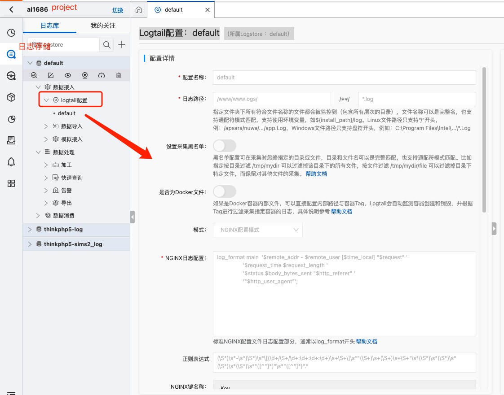

## 关于日志服务（SLS）

> 介绍

这里有几个概念，项目project，日志存储Logstore，集器logtail，机器组。

> 计费

**为什么用**

## 采集

> 认证

如果同一ECS账号下,不用身份认证

## 生产者规范

## 应用案例

> nginx 统计pv pu

> 项目异常处理

error 外其他级别处理，汇中统计

error 等级别，立即报警

## 迭代

* 2022年03月26日 23:59:59 初稿

## 参考

1、