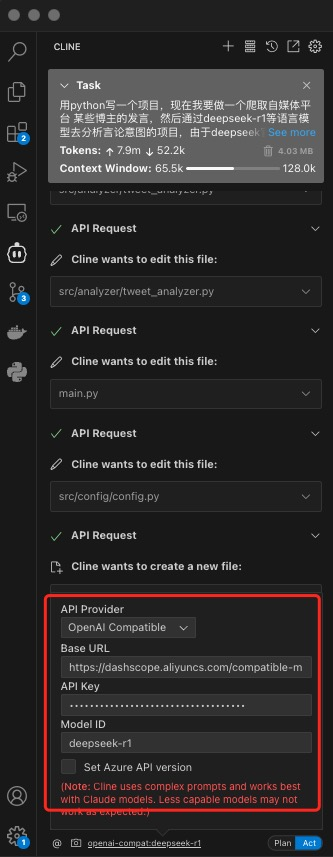

## 起因

自动化编程可以省下很多手动编程的劳动，你只要有主意，只需要prompt好，主要工作就是交给ai来做了。前有cursor后有cline。cursor是商业化项目，20刀每月，cline是开源项目，费用主要是调用模型api接口的费用，然后各大厂商有很多免费的额度可以调用，所以要省钱的我当然选择cline啦！cline是微软vscode的一个扩展，我本身也是用的vscode作为编辑器，所以可以无缝衔接。

## 安装

在vscode的侧边栏，点击扩展，搜索，安装。

## 配置

在左侧边栏编辑，找到模型配置

编辑配置，这里用的是[阿里云百炼](https://bailian.console.aliyun.com/#/home) 有免费额度的deepseek-r1。

选择OpenAi Compatible，阿里云百炼的base url为https://dashscope.aliyuncs.com/compatible-mode/v1，api key在https://bailian.console.aliyun.com/?apiKey=1
生成一个。

## 案例

让ai帮我写一个监控推特的项目,并将推文整理翻译推送到企业微信上

## 思考

整体用下来，deepseek的上下文最大64kb，大一点的项目，根本就不知道前面提了什么，时不时就重新开始自圆其说了，所以对于代码编写这里还是没那么流畅，在加上deepseek加了深度思考，要有分析的过程，期待后面deepseek出一个适合ai编程的模型吧！

## 迭代

* 2025年02月13日 14:00:00 初稿

